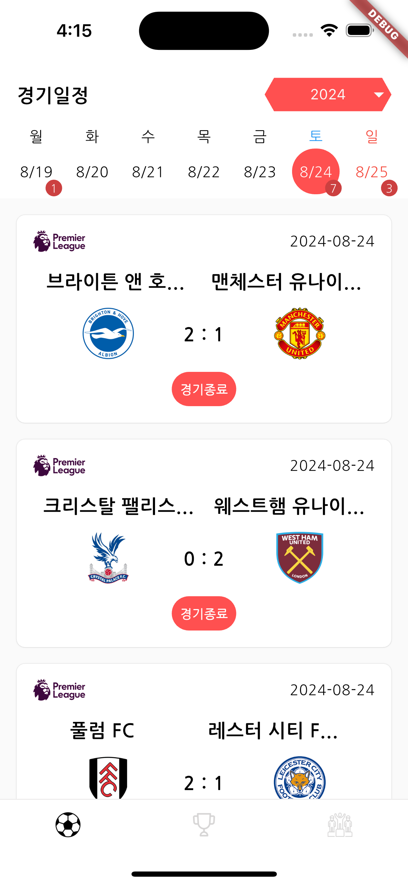
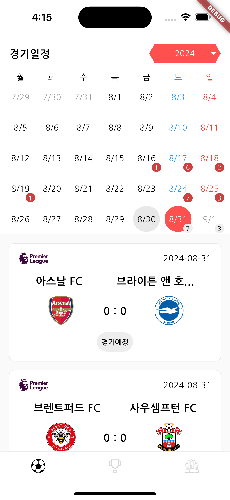
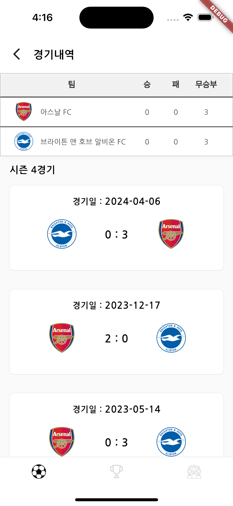
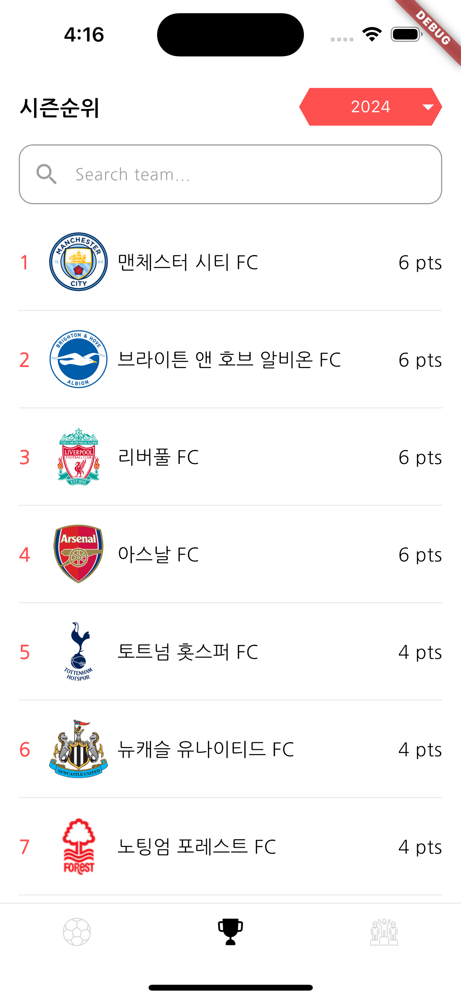
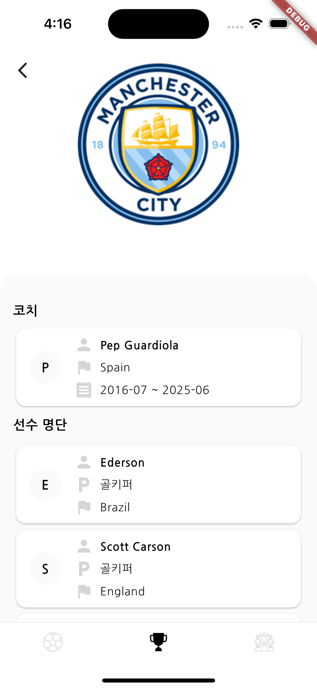
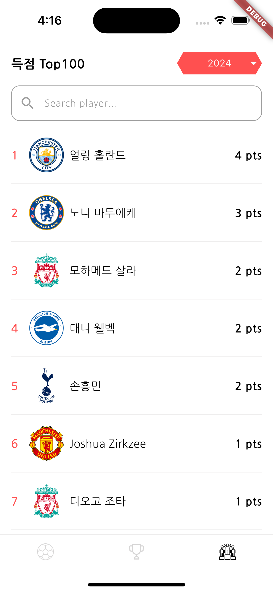
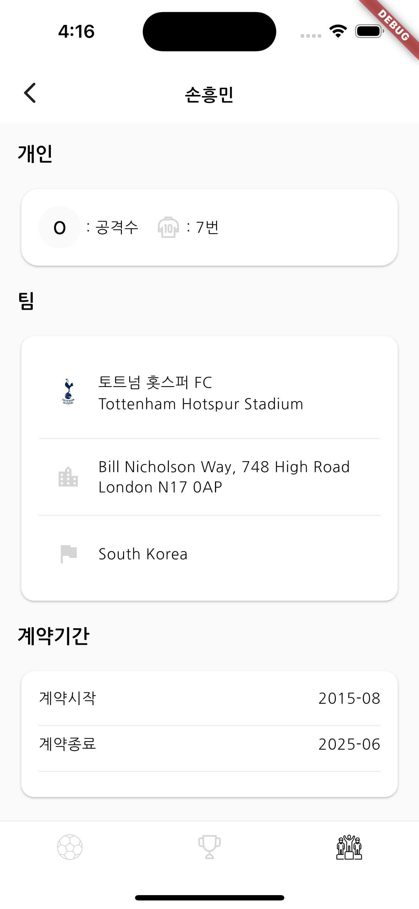

# football_premier_league

footballPremierLeague

football-data.org 의 무료 API를 이용한 프리미어리그 경기일정 및 랭킹, 팀, 개인선수 정보를 볼 수 있는 AOS, IOS 앱입니다.

사용된 라이브러리:
- riverpod
- riverpod_annotation
- flutter_riverpod
- hooks
- hooks_riverpod
- go_router
- shared_preferences
- cached_network_image
- dio
- freezed_annotation
- json_annotation

<h3>스크린샷</h3>

    
    
    
    
    
    
    

